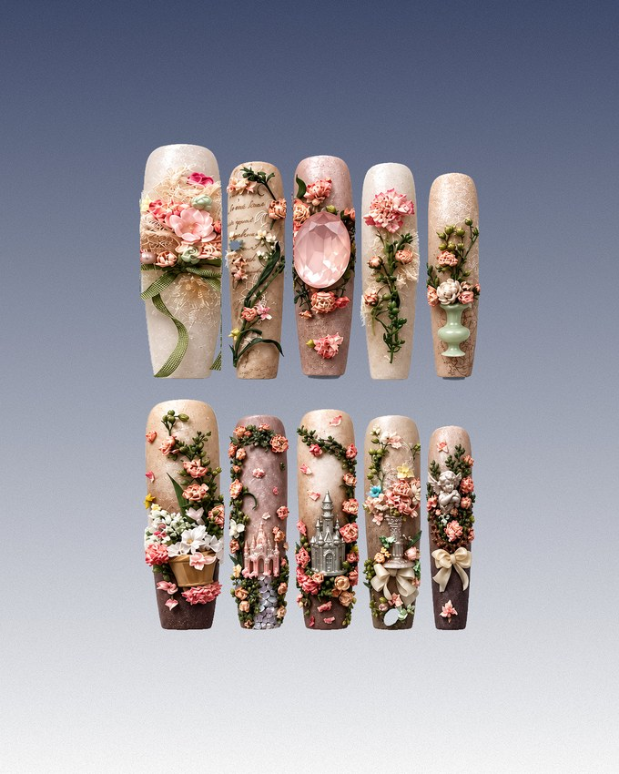
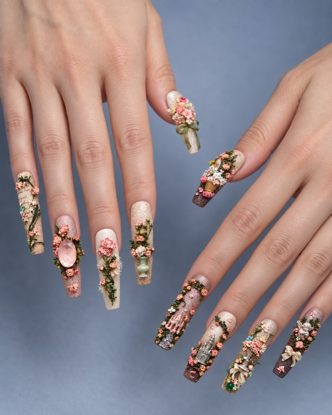

# Muse10款式生成

把美甲参考照片制作成符合真实双手十指比例、使用固定陈列模板的商品视觉：

**参考照片 → 款式与指位清单 → 十片陈列母版 → 同款双手佩戴 → 局部特写 → 可交互预览**

每排是一只手，从左到右对应拇指、食指、中指、无名指、小指。两排第一片都是更宽的拇指甲。不同款式共用同一张背景底图和十指陈列模板，只替换美甲设计。

| 十片陈列预览 | 同款双手佩戴 | 局部特写 |
| --- | --- | --- |
|  |  |  |

以上为花园款效果示例，不替代新用户的款式来源。陈列示例是压缩预览；固定背景与尺寸基准见 [assets/catalog](assets/catalog)。三张图是同款的不同视角。

## 修正后的核心标准

- **真实十指**：准确十片，两排各五片。拇指甲更宽，其余四指也各有尺寸；佩戴图必须沿用同一指位映射。
- **逐片对齐**：分别核对甲片本体宽高、位置、间距与留白。商品卡外框相同、整组缩放或居中，不能证明甲片尺寸正确。
- **固定背景**：直接复用同一底图，固定灰蓝至灰白的色调、亮度、渐变和颗粒。每款独立生成的相似蓝色、云雾、光斑或额外投影不符合要求。
- **保护款式细节**：饰品外接框与甲片本体分开检查，不能把花束当作拇指宽度，也不能为塞入模板而拉扁宝石、硬裁丝带或补出假边。
- **完整商品卡**：按用户指定位置加入原网格，统一图片、名称和价格排版。未知价格明确待定，不编价，不用“十片套组”代替售价。
- **尊重讨论阶段**：用户说先不要生成时暂停生成与网站修改；收到继续实施的指令后执行已确认要求。

具体问题、原因与检查方法见 [陈列标准与问题修正](references/catalog-standard.md)。

## 安装与使用

1. 下载或克隆本仓库。
2. 将 `skills/muse10-nail-visuals` 整个文件夹复制到 `~/.codex/skills/`，保留子目录。
3. 在 Codex 上传参考照片并调用：

> 使用 $muse10-nail-visuals，按固定背景和真实双手十指尺寸，将我的照片制作成十片陈列、同款上手图与特写。每排第一片是更宽的拇指甲，先做预览。

中文展示名称已统一为 **Muse10款式生成**；安装目录和调用标识保留 `muse10-nail-visuals`，原有链接与调用方式继续可用。

默认制作独立预览。用户明确要求修改或发布网站时，再执行对应网站工作。用户新指定的模板、款式和范围优先于包内示例。

## 固定模板与检查

- [background.png](assets/catalog/background.png)：当前指定的 1200 × 1500 背景母版。
- [template.json](assets/catalog/template.json)：十个指位的排版与尺寸基准。像素值用于商品陈列，不代表实际毫米尺码。
- [check_catalog_background.py](scripts/check_catalog_background.py)：只读检查画布尺寸与共享背景像素，需要 Pillow。

```bash
python3 ~/.codex/skills/muse10-nail-visuals/scripts/check_catalog_background.py \
  --image /absolute/path/to/master.png
```

默认要求高清母版的共享背景像素一致。脚本不检查真实指位、甲片外形或装饰完整性，仍需实际看图；不能把构建通过或外框相等当作“一比一”验收。

## 预览交互与打包

默认显示十片陈列，鼠标移入临时显示佩戴图，移出恢复。箭头、键盘或手机横滑可切图，手动操作后保留当前视角。点击作品或名称可查看大图并返回。一套作品对应一个卡片，多套采用三列布局。

完整流程使用当前环境中的 `imagegen` 和 `visualize` 能力，安装本技能不会自动提供图像模型或网站后端。`scripts/build_preview.py` 使用 Python 3 标准库，把已有本地图片嵌入 HTML 片段，不联网、不生成图片、不修改或发布网站：

```bash
python3 ~/.codex/skills/muse10-nail-visuals/scripts/build_preview.py \
  --manifest ~/.codex/skills/muse10-nail-visuals/assets/examples/gallery.json \
  --output ./muse10-preview.html
```

输出文件必须尚不存在且小于 1 MB。高清母版另存，预览使用压缩副本。图库图标依赖 `visualize` 宿主提供的全局 `lucide` 对象；HTML 片段本身不等于可在微信打开的公开链接。

完整规则见 [SKILL.md](SKILL.md)，图像提示词见 [references/prompts.md](references/prompts.md)，图库规则见 [references/gallery.md](references/gallery.md)。
